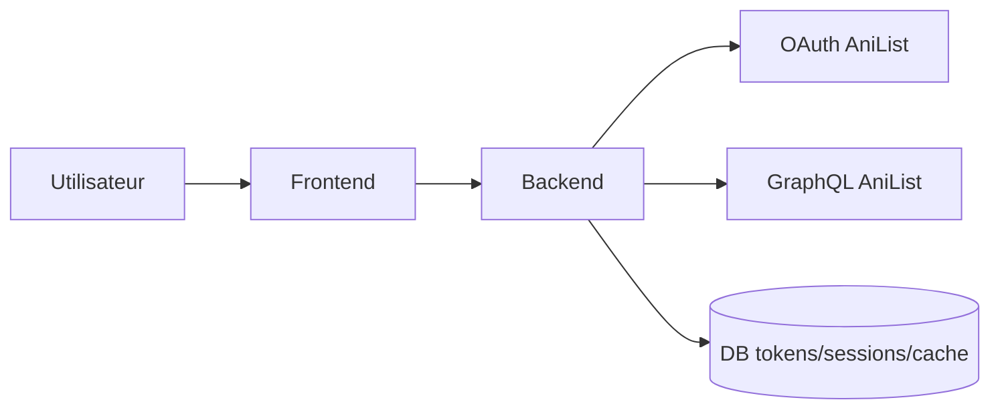
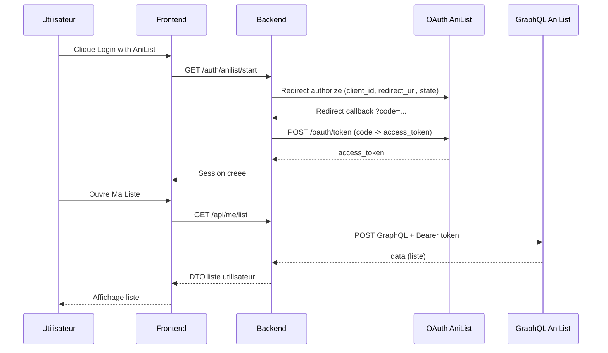

# AniList User Flow (Base sur anilist-backend-logic.md)

Ce document decrit les parcours utilisateur principaux pour une application integrant AniList via un backend serveur.

## 1) Acteurs

- Utilisateur non connecte
- Utilisateur connecte via AniList
- Frontend web/mobile
- Backend applicatif
- API AniList (`https://graphql.anilist.co`)
- OAuth AniList (`https://anilist.co/api/v2/oauth/...`)

## 2) User Flow global

## 3) Flow A: Utilisateur anonyme consulte des donnees publiques

Objectif: rechercher un anime sans authentification.

1. L'utilisateur ouvre la page Explorer.
2. Le frontend envoie une requete au backend: `/api/anime/search?q=...`.
3. Le backend construit une query GraphQL AniList (sans `Authorization`).
4. Le backend appelle `POST https://graphql.anilist.co`.
5. AniList retourne `data` (et potentiellement `errors`).
6. Le backend:
   - verifie `errors` meme si HTTP 200,
   - applique mapping DTO,
   - met en cache si pertinent.
7. Le frontend affiche la liste d'anime.

Resultat: parcours rapide, public, sans login.

## 4) Flow B: Connexion avec AniList (Authorization Code)

Objectif: permettre acces aux donnees privees et mutations.

1. L'utilisateur clique `Login with AniList`.
2. Le frontend redirige vers le backend auth start.
3. Le backend redirige vers:
   - `https://anilist.co/api/v2/oauth/authorize`
   - avec `client_id`, `redirect_uri`, `response_type=code`, `state`.
4. L'utilisateur autorise l'application sur AniList.
5. AniList redirige vers le callback backend avec `code`.
6. Le backend echange le `code` via:
   - `POST https://anilist.co/api/v2/oauth/token`
   - payload: `grant_type=authorization_code`, `client_id`, `client_secret`, `redirect_uri`, `code`.
7. Le backend recoit `access_token`, puis le stocke de maniere securisee.
8. Le backend cree/met a jour la session utilisateur locale.
9. Le frontend est redirige vers une page connectee (`dashboard`, `sync`, etc.).

Resultat: utilisateur authentifie, operations privees autorisees.

## 5) Flow C: Recuperer le profil connecte (Viewer)

Objectif: afficher les informations AniList de l'utilisateur.

1. Le frontend appelle `/api/me`.
2. Le backend recupere le token AniList lie a la session.
3. Le backend execute une query `Viewer` avec header:
   - `Authorization: Bearer <access_token>`.
4. AniList retourne les donnees utilisateur.
5. Le backend normalise le format de reponse.
6. Le frontend affiche profil/statistiques/listes.

## 6) Flow D: Pagination dans la recherche

Objectif: charger plusieurs pages de resultats.

1. Le frontend demande `page=1`, `perPage=25`.
2. Le backend interroge AniList avec l'objet `Page`.
3. Le backend lit `pageInfo.hasNextPage`.
4. Si `true`, le frontend peut demander page suivante.
5. Repetition jusqu'a `hasNextPage=false`.

Regle critique AniList:

- Dans un meme `Page`, utiliser une seule collection principale (`media` ou `characters`, etc.).

## 7) Flow E: Mutation utilisateur (ex: update list entry)

Objectif: modifier une entree de liste anime/manga.

1. L'utilisateur soumet une action (score, status, progression).
2. Le frontend appelle endpoint backend protege.
3. Le backend:
   - valide les inputs,
   - verifie session/token,
   - envoie la mutation AniList authentifiee.
4. AniList repond avec succes ou erreur de validation.
5. Le backend:
   - invalide/rafraichit les caches utilisateur,
   - renvoie un message metier propre.
6. Le frontend met a jour l'UI.

## 8) Flow F: Gestion des erreurs

## 8.1 Erreur GraphQL avec HTTP 200

1. AniList renvoie `errors` dans la payload.
2. Le backend convertit vers un format d'erreur interne.
3. Le frontend affiche un message utilisateur comprehensible.

## 8.2 Rate limit (429)

1. AniList renvoie `429 Too Many Requests`.
2. Le backend lit `Retry-After` et `X-RateLimit-Reset`.
3. Le backend applique retry borne + backoff/jitter.
4. Si echec persistant, retour d'un message de saturation temporaire.

## 8.3 Token expire

1. Requete authentifiee echoue car token invalide/expire.
2. Pas de refresh token AniList disponible.
3. Le backend invalide la session AniList locale.
4. Le frontend redirige l'utilisateur vers re-auth AniList.

## 9) User Flow sequence (connexion + premiere action privee)

## 10) Etats UX recommandes

- `idle`: ecran pret.
- `loading`: spinner/skeleton.
- `success`: data rendue.
- `empty`: aucun resultat.
- `partial`: data partielle + warning discret.
- `rate_limited`: message temporaire + retry guide.
- `auth_required`: bouton reconnecter AniList.
- `error`: echec non recuperable.

## 11) Regles de securite appliquees au flow

- Utiliser `state` sur OAuth callback (anti-CSRF).
- Ne jamais exposer `client_secret` cote frontend.
- Chiffrer tokens au repos.
- Ajouter timeout reseau sur chaque appel AniList.
- Logger sans exposer secrets ni token brut.

## 12) KPIs de suivi du flow

- Taux de login AniList reussi.
- Taux de callback OAuth en erreur.
- Taux d'erreurs GraphQL (4xx/5xx logiques).
- Nombre de `429` par minute.
- Latence p95 des endpoints backend vers AniList.
- Taux de succes des mutations utilisateur.
